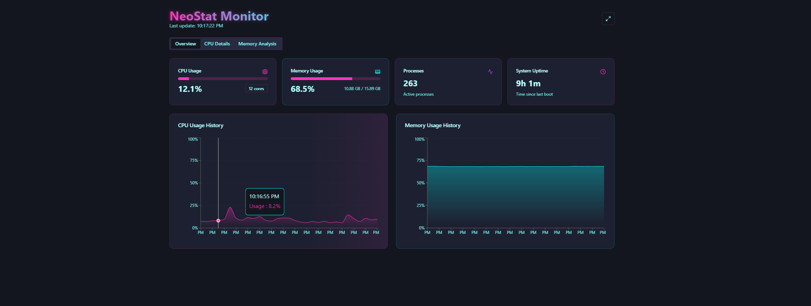
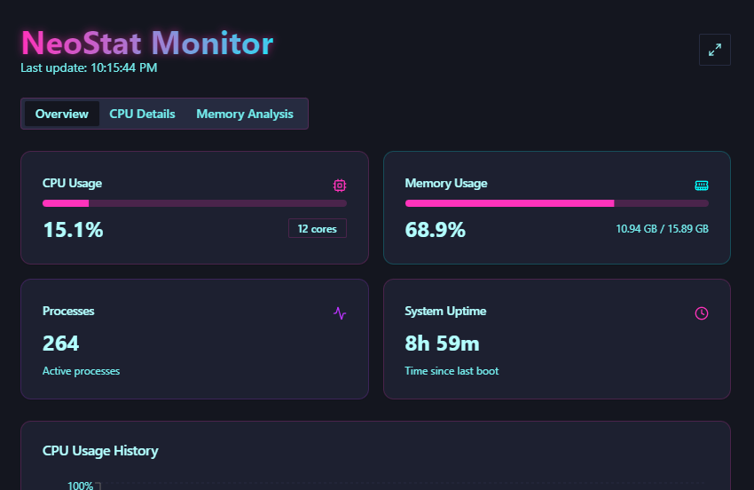
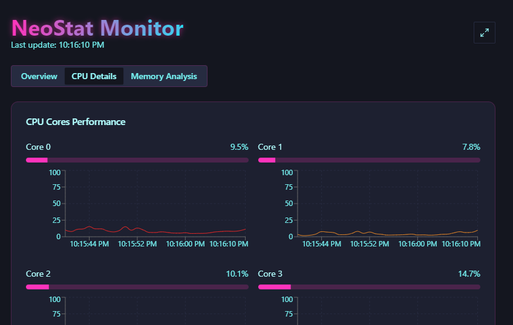

# NeoStat

A simple system monitor built with Tauri, React, and Rust, featuring a cyberpunk interface and real-time system resource monitoring.



## Features
- 🖥️ Real-time CPU and Memory monitoring
- 📈 Interactive styled charts
- 💻 Per-core CPU monitoring
- 🎨 Modern interface with dark mode
- 📱 Responsive design

## Stack
- React + TypeScript
- Tauri (Rust)
- TailwindCSS + shadcn/ui
- Recharts

## Running

Prerequisites: Node.js, Rust, pnpm

```bash
# Clone
git clone https://github.com/jltrench/neostat

# Install
cd neostat
pnpm install

# Dev mode
pnpm tauri dev

# Build
pnpm tauri build
```

## Preview

<div align="center">
  
  
</div>

## License
MIT